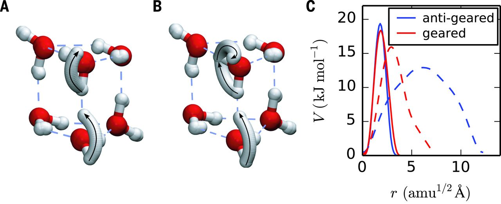

<!--

  You can also find my articles on <u><a href="{{author.googlescholar}}">my Google Scholar profile</a>.</u>





  

-->

Publications
============

*   Water Triggers Hydrogen Bond Network Reshaping in the Glycoaldehyde Dimer  
    C. Perez, A. Steber, B. Temelso, Z. Kisiel, and M. Schnell  
    **Angewandte Chemie** in press (**2020**)  
    (doi: [10.1002/anie.201914888](http://doi.org/10.1002/anie.201914888))  
    
    
*   Computation of Atmospheric Concentrations of Molecular Clusters from ab initio Thermochemistry  
    T. T. Odbadrakh, A. G. Gale, B. T. Ball, B. Temelso, G. C. Shields  
    **J. of Visualized Experiments** in press (**2020**) [Article](https://www.jove.com/video/60964/computation-atmospheric-concentrations-molecular-clusters-from-ab)  
     
    
*   Water Induces the Same Crown Shapes as Li+ or Na+ in 15-Crown-5 Ether: a Broadband Rotational Study  
    J. C. Lopez, C. Perez, S. Blanco, V. A. Shubert, B. Temelso, G. C. Shields, and M. Schnell  
    **Phys. Chem. Chem. Phys.** 21, 2875-2881 (**2019**)  
    (doi: [10.1039/C8CP05552A](http://doi.org/10.1039/C8CP05552A))  
    
    
*   Exploring the Rich Potential Energy Surface of (H2O)11 and Its Physical Implications  
    B. Temelso, K. L. Klein\*, J. W. Mabey\*, C. Perez, B. H. Pate, Z. Kisiel, G. C. Shields.  
    **J Chem. Theory Comput.** 14(2) 1141-1152 (**2018**)  
    (doi: [10.1021/acs.jctc.7b00938](http://doi.org/10.1021/acs.jctc.7b00938))  
    
    
*   Effect of Mixing Ammonia and Alkylamines on Sulfate Aerosol Formation  
    B. Temelso, E. F. Morrison\*, D. L. Speer\*, B. C. Cao\*, N. Appiah-Padi\*, G. Kim\*, G. C. Shields.  
    **J Phys. Chem. A.** 122, 1612-1622 (**2018**)  
    (doi: [10.1021/acs.jpca.7b11236](http://doi.org/10.1021/acs.jpca.7b11236))  
    **[ACS Editors' Choice](https://pubs.acs.org/editorschoice/#"") for Feb 06, 2018**.  
    
    
*   Capturing the Elusive Water Trimer from the Stepwise Growth of Water on the Surface of the Polycyclic Aromatic Hydrocarbon Acenaphthene  
    A. L. Steber, C. Perez, B. Temelso, G. C. Shields, A. M. Rijs, B. H. Pate, Z. Kisiel, and M. Schnell  
    **J Phys. Chem. Lett.** 8, 5744-5750 (**2017**)  
    (doi: [10.1021/acs.jpclett.7b02695](http://doi.org/10.1021/acs.jpclett.7b02695))  
    
    
*   ArbAlign: A Tool for Optimal Alignment of Arbitrarily Ordered Isomers Using the Kuhn-Munkres Algorithm.  
    B. Temelso, J. M. Mabey, T. Kubota, N. Appiah-Padi, G. C. Shields.  
    **J Chem. Inf. Model.** 57 (5), 1045-1054 (**2017**)  
    (doi: [10.1021/acs.jcim.6b00546](http://doi.org/10.1021/acs.jcim.6b00546))  
    
    
*   Corannulene and its complex with water: A tiny cup of water  
    C. Pérez,A. L. Steber, A. M. Rijs, B. Temelso, G. C. Shields, J. C. Lopez, Z. Kisiel, M. Schnel  
    **Phys. Chem. Chem. Phys.** 19, 14214-14223 (**2017**)  
    (doi: [10.1039/C7CP01506B](http://doi.org/10.1039/C7CP01506B))  
      
    (Cover by Cristobal Pérez: [PDF](http://pubs.rsc.org/en/content/articlepdf/2017/cp/c7cp90119d))  
    
    
*   Concerted hydrogen-bond breaking by quantum tunneling in the water hexamer prism.  
    J. O. Richardson, C. Pérez, S. Lobsiger, A. A. Reid, B. Temelso, G. C. Shields, Z. Kisiel, D. J. Wales, B. H. Pate, S. C. Althorpe  
    **Science** 351, 1310-1313 (**2016**)  
    (doi: [10.1126/science.aae0012](http://science.sciencemag.org/content/351/6279/1310))  
    
    
*   The Importance and Reliability of Small Basis Set CCSD(T) Corrections to MP2 Binding and Relative Energies of Water Clusters.  
    B. Temelso, C. R. Renner, G. C. Shields  
    **J. Chem. Theory and Comp.** 11(4), 1439–1448 (**2015**)  
    (doi: [10.1021/ct500944v](http://pubs.acs.org/doi/abs/10.1021/ct500944v))  
    
    
*   Formation of deprotonated 2-imidazoline-4(5)-one product ions in the collision-induced dissociation of some serine-containing dipeptides.  
    J. S. Swan, P. M. Findeis, S. Hilton, K. M. Lebold, B. Temelso, G. C. Shields  
    **Int. J. Mass Spec..** 381-382, 25-32, (**2015**)  
    (doi: [10.1016/j.ijms.2015.03.005](http://dx.doi.org/10.1016/j.ijms.2015.03.005))  
    
    
*   Hydrogen Bond Cooperativity and the Three-Dimensional Structures of Water Nonamers and Decamers.  
    C. Pérez, D. P. Zaleski, N. A. Seifert, B. Temelso, G. C. Shields, Z. Kisiel, B. H. Pate.  
    **Angewandte Chemie** 53(52), 14368-14372 (**2014**)  
    (doi: [10.1002/anie.201407447](http://dx.doi.org/10.1002/anie.201407447))  
    
    
*   Hydration of the Sulfuric Acid−Methylamine Complex and Implications for Aerosol Formation.  
    D. J. Bustos,\* B. Temelso and G. C. Shields  
    **J. Phys. Chem. A.** 118(35), 7430-7441 (**2014**)  
    (doi: [10.1021/jp500015t](http://dx.doi.org/10.1021/jp500015t))  
    
    
*   Structural Analysis of Alpha-Fetoprotein (AFP)-like Peptides with Anti- Breast-Cancer Properties.  
    B. Temelso, K. A. Alser,\* A. Gauthier,\* A. K. Palmer\* and G. C. Shields  
    **J. Phys. Chem. B** 118(17), 4514-4526 (**2014**)  
    (doi: [10.1021/jp500017b](http://dx.doi.org/10.1021/jp500017b))  
    
    
*   Structure and thermodynamics of H3O+(H2O)8 clusters: A combined molecular dynamics and quantum mechanics approach.  
    B. Temelso, T. Köddermann, K. N. Kirschner, K. Klein\* and G. C. Shields  
    **Comp. Theor. Chem.** 1021, 240-248 (**2013**)  
    (doi: [10.1016/j.comptc.2013.07.039](http://dx.doi.org/10.1016/j.comptc.2013.07.039))  
    
    
*   Broadband Fourier Transform Rotational Spectroscopy for Structure Determination: The Water Heptamer.  
    C. Pérez, S. Lobsiger, N. A. Seifert, D. P. Zaleski, B. Temelso, G. C. Shields, Z. Kisiel, B. H. Pate  
    **Chem. Phys. Lett** 571, 1-15 (**2013**)  
    (doi: [10.1016/j.cplett.2013.04.014](http://dx.doi.org/10.1016/j.cplett.2013.04.014))  
    
    
*   Structures of Cage, Prism, and Book Isomers of Water Hexamer from Broadband Rotational Spectroscopy.  
    C. Pérez, M. T. Muckle, D. P. Zaleski, N. A. Seifert, B. Temelso, G. C. Shields, Z. Kisiel, B. H. Pate  
    **Science** 336, 897-901 (**2012**)  
    (doi: [10.1126/science.1220574](http://www.sciencemag.org/content/336/6083/897.full))  
    
    
*   Computational Study of the Hydration of Sulfuric Acid Dimers: Implications for Acid Dissociation and Aerosol Formation.  
    B. Temelso, T. N. Phan\* and G. C. Shields  
    **J. Phys. Chem. A.** 116(39), 9745-9758 (**2012**)  
    (doi: [10.1021/jp3054394](http://dx.doi.org/10.1021/jp3054394))  
    
    
*   Hydration of the Bisulfate Ion: Atmospheric Implications.  
    D. E. Husar,\* B. Temelso, A. Asheworth\* and G. C. Shields  
    **J. Phys. Chem. A.** 116, 5151-5163 (**2012**)  
    (doi: [10.1021/jp300717j](http://dx.doi.org/10.1021/jp300717j))  
    
    
*   Quantum Mechanical Study of Sulfuric Acid Hydration: Atmospheric Implications.  
    B. Temelso, T. Morrell,\* R. Shields,\* M. Allodi,\* E. Wood,\* K. N. Kirschner, T. Castonguay, K. Archer\* and G. C. Shields  
    **J. Phys. Chem. A.** 119, 2209-2224 (**2012**)  
    (doi: [10.1021/jp2119026)](http://dx.doi.org/10.1021/jp2119026))  
    
    
*   Isotopic Ratios in Titan’s Methane: Measurements and Modeling.  
    C. A. Nixon, B. Temelso, S. Vinatier, N. A. Teanby, B. Bézard, R. K. Achterberg, K. E. Mandt, C. D. Sherrill, P. G. J. Irwin, D. E. Jennings, P. N. Romani, A. Coustenis, F. M. Flasar  
    **Astrophys. J.** 749, 159 (**2012**)  
    (doi: [10.1088/0004-637X/749/2/159](http://m.iopscience.iop.org/0004-637X/749/2/159))  
    
    
*   Benchmark Structures and Binding Energies of Small Water Clusters with Anharmonicity Corrections.  
    B. Temelso, K. A. Archer and G. C. Shields  
    **J. Phys. Chem. A.** 117, 12034-12046 (**2011**)  
    (doi: [10.1021/jp2069489)](http://pubs.acs.org/doi/abs/10.1021/jp2069489)  
    
    
*   The Role of Anharmonicity in Hydrogen-Bonded Systems: The Case of Water Clusters.  
    B. Temelso and G. C. Shields  
    **J. Chem. Theory and Comp.** 7, 2804-2817 (**2011**)  
    (doi: [10.1021/ct2003308](http://pubs.acs.org/doi/abs/10.1021/ct2003308)  
    
    
*   Accurate Predictions of Water Cluster Formation, (H2O)n=2-10.  
    R. M. Shieids, B. Temelso, K. A. Archer and G. C. Shields  
    **J. Phys. Chem. A** 140. 11725-11737 (**2010**)  
    (doi: [10.1021/jp911493b](http://pubs.acs.org/doi/abs/10.1021/jp104865w))  
    
    
*   Ab Initio Thermochemistry of the Hydrogenation of Hydrocarbon Radicals Using Silicon-, Germanium-, Tin-, And Lead-Substituted Methane and Isobutane,  
    B. Temelso, C. D. Sherrill, R. C. Merkle, and R. A. Freitas,  
    **J. Phys. Chem. A** 110, 8677-8688 (**2007**)  
    (doi: [10.1021/jp071797k](http://dx.doi.org/10.1021/jp071797k))  
    
    
*   High-Level Ab Initio Studies of Hydrogen Abstraction From Prototype Hydrocarbon Systems,  
    B. Temelso, C. D. Sherrill, R. C. Merkle, and R. A. Freitas,  
    **J. Phys. Chem. A** 110, 11160-11173 (**2006**)  
    (doi: [10.1021/jp061821e](http://dx.doi.org/10.1021/jp061821e))  
    
    
*   Hybrid Correlation Models Based On Active-space Partitioning: Seeking Accurate O(N5) Ab Initio Methods for Bond Breaking,  
    A. D. Bochevarov, B. Temelso, and C. D. Sherrill,  
    **J. Chem. Phys.** 125, 054109 (**2006**) ([PDF Full Text](http://vergil.chemistry.gatech.edu/pubs/pdf/bochevarov_2006_054109.pdf))  
    (doi: [10.1063/1.2222350](http://dx.doi.org/10.1063/1.2222350))  
    
    
*   High Accuracy **Ab Initio** Studies of Li6+, Li6\-, and Three Isomers of Li6,  
    B. Temelso and C. D. Sherrill,  
    **J. Chem. Phys.** 122, 064315 (**2005**) ([PDF Full Text](http://vergil.chemistry.gatech.edu/pubs/pdf/temelso_2005_064315.pdf))  
    (doi: [10.1063/1.1846671](http://dx.doi.org/10.1063/1.1846671))  
    
    
*   A Comparison of One-Particle Basis Set Completeness, Higher-Order Electron Correlation, Relativistic Effects, And Adiabatic Corrections for Spectroscopic Constants of BH, CH+, and NH,  
    B. Temelso, E. F. Valeev, and C. D. Sherrill,  
    **J. Phys. Chem. A** 108, 3068-3075 (**2004**) ([Abstract](http://vergil.chemistry.gatech.edu/pubs/abstracts/temelso_2004_3068.html))  
    (doi: [10.1021/jp036933+](http://dx.doi.org/10.1021/jp036933+))  
    
    
*   Characterization of the Electronic States of the Phosphaethyne Cation (HCP+),  
    B. Temelso, N. A. Richardson, L. Sari, Y. Yamaguchi, and H. F. Schaefer III  
    **J. Theor. Comp. Chem.** 4, 707 (**2005**)  
    (doi: [10.1142/S0219633605001738](http://vm-jn.wspc.com.sg/jtcc/04/04spec01/S0219633605001738.html))  
    
