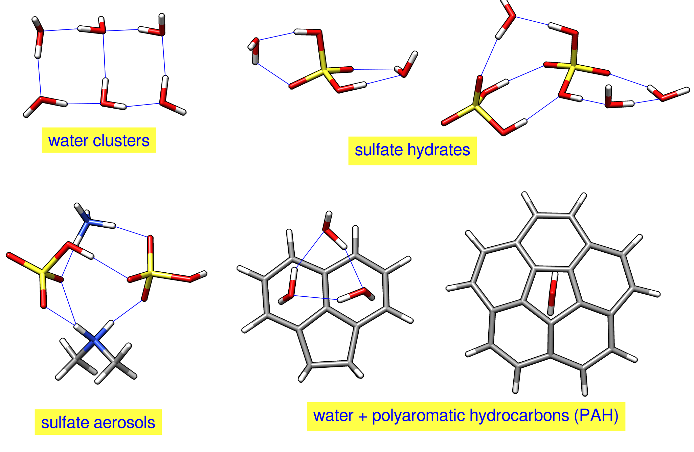

<!--



  

-->

## Hydrogen-bonded Molecular Clusters

Most of my research involves determining the structure and
property of molecular clusters held together by hydrogen bonds. Hydrogen bonds are responsible for
giving water and biological molecules their unique structure and properites. However, developing a
water model that can describe all its unusual and crucial properties has proven difficult. We
predict the structure of small molecular clusters of pure water, small hydrates of atmosphereic
interest and complexes of water with polyaromatic hydrocarbons (PAHs) of astrophysical interest. In
collaboration with experimental colleagues, we examine the structure and stability of these
molecular clusters as well as the implications of our findings for atmospheric aerosol formation and
ability of extraterrestrial environments to sustain life.  

  
_Figure 1. We apply computational chemistry tools to problems in physical and atmospheric chemistry._  

Because these molecular clusters are held together by weak and dynamic hydrogen bonds, the kinds of
structures they can form and their relative stability is very hard to determine. We develop and
apply different tools to 1) sample the large number of configurations these clusters can adapt
efficiently and 2) determine which ones are important. For example, we have applied the protocol
below to systems ranging from water clusters and sulfate aerosols to small peptides.  

  
_Figure 2. A protocol to efficiently search a large number of configurations and determine the most stable molecular clusters._  
  

## Structure Alignment 
One of the challenges in studying molecular clusters is determining how similar or different isomers
are. One recently developed resource is [**ArbAlign**](http://arbalign.org/) which is a web and
command line tool to align any two isomers for accurately assessing their similarity.  

  
_Figure 3. A tool to align any arbitrarily ordered structures efficiently using a Kuhn-Munkres algorithm._  
  

## Molecular Cluster Repository
Another work under development is a [**Molecular Clusters Repository**](http://molecularclusters.xyz/) to compile and share published structures and energies of molecular clusters in a convenient way.  

  
_Figure 4. MolRepo is a repository of molecular clusters' structure and energy. It currently only has results from our own publications, but others can upload their results.
